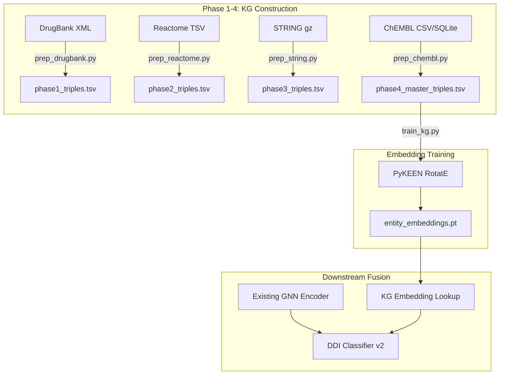

# Knowledge Graph Pipeline — Implementation Plan

## Background

The current DrugInsight pipeline uses:
- **GNN Encoder** (`AttentiveFP`, 256-dim embeddings) on molecular SMILES graphs
- **DDI Classifier** (MLP trunk: 518→512→256→128→1) with 6 hand-crafted extra features (shared enzymes, targets, transporters, carriers, PRR, TWOSIDES flag)
- **Feature Extractor** reading from DrugBank CSVs in `data/processed/`
- Current best **val AUC ≈ 0.63** — plenty of room for improvement

The goal is to build a **Multimodal Knowledge Graph** using DrugBank + Reactome + STRING + ChEMBL data, train **RotatE embeddings** via PyKEEN, and fuse those embeddings into the downstream classifier as additional features.

---

## Architecture Overview



---

## Phase 1 — DrugBank Baseline

### Data we already have
All CSVs in [data/processed/](file:///c:/Documents/MOTASSIM%20COLLEGE%20SHIT/DrugInsightv2/data/processed):
- `drugbank_drugs.csv` — drug names, IDs, synonyms
- `drugbank_targets.csv` — drug→target with actions
- `drugbank_enzymes.csv` — drug→enzyme with actions
- `drugbank_transporters.csv` — drug→transporter
- `drugbank_carriers.csv` — drug→carrier

### What the script does

#### [NEW] `src/kg/prep_drugbank.py`
1. Read the 4 protein-type CSVs (targets, enzymes, transporters, carriers)
2. Build a unified node dictionary: `Drug` nodes (DrugBank IDs) + `Protein` nodes (target/enzyme/transporter/carrier IDs)
3. Map `actions` column → relation types: `acts_on`, `inhibits`, `induces`, `binds` (fallback: `interacts_with`)
4. Emit triples as `[head_id, relation_type, tail_id]`
5. Save → `data/interim/phase1_triples.tsv` + `data/interim/node_dict.json`
6. Support `--n-samples 5000` for dry-run validation

### Output
`data/interim/phase1_triples.tsv` — est. ~50-80K triples from existing DrugBank data.

---

## Phase 2 — Reactome Convergence

### External data required
- `UniProt2Reactome_All_Levels.txt` ([download](https://reactome.org/download-data)) — ~2.5M rows, TSV

#### [NEW] `src/kg/prep_reactome.py`
1. Read `UniProt2Reactome_All_Levels.txt` in chunks (`chunksize=50000`) to avoid OOM
2. Filter strictly by `Homo sapiens`
3. Map UniProt IDs → `Protein` node IDs from Phase 1's `node_dict.json`. Orphans (UniProt IDs not matching any DrugBank protein) are dropped with a logged percentage
4. Extract triples:
   - `Protein → participates_in → Reaction`
   - `Reaction → part_of → Pathway`
5. Append Phase 1 triples → save `data/interim/phase2_triples.tsv`

### Output
`data/interim/phase2_triples.tsv` — Phase 1 triples + Reactome pathway hierarchy.

---

## Phase 3 — STRING Integration

### External data required
- `9606.protein.links.v12.0.txt.gz` ([STRING DB](https://string-db.org/cgi/download)) — ~12M rows for human
- `9606.protein.info.v12.0.txt.gz` — for ENSP → gene name mapping
- A UniProt ↔ Ensembl mapping file (from [UniProt ID Mapping](https://www.uniprot.org/id-mapping))

#### [NEW] `src/kg/prep_string.py`
1. Read STRING links file with `chunksize=50000`
2. Filter: `combined_score > 700` (high confidence only) — reduces ~12M → ~2-3M edges
3. Map Ensembl Protein IDs (ENSP) → UniProt → `Protein` node IDs via the mapping file
4. Construct symmetric edges: `Protein A → physically_interacts_with → Protein B`
5. Deduplicate (A,B) vs (B,A), keep one canonical direction
6. Append to Phase 2 → save `data/interim/phase3_triples.tsv`

### Output
`data/interim/phase3_triples.tsv` — cumulative graph with PPI edges.

---

## Phase 4 — ChEMBL & RotatE Adaptation

### External data required
- ChEMBL SQLite dump or CSV export of `activities` + `assays` + `compound_records` tables
- UniChem or RDKit canonical SMILES for DrugBank↔ChEMBL ID bridging

#### [NEW] `src/kg/prep_chembl.py`
1. Query ChEMBL for active compound–target pairs with IC50/Ki values
2. Map ChEMBL compound IDs → SMILES → DrugBank IDs (via SMILES canonicalization against `drugbank_smiles_filtered.csv`)
3. Map ChEMBL target IDs → UniProt → existing `Protein` node IDs
4. Bucket continuous values into categorical relations:
   - IC50 < 100 nM → `strongly_inhibits`
   - 100–1000 nM → `moderately_binds`
   - 1000–10000 nM → `weakly_binds`
5. **Replace** overlapping Phase 1 binary edges with these graded edges
6. Save final → `data/interim/phase4_master_triples.tsv`

---

## Embedding Training

#### [NEW] `src/kg/train_kg.py`
1. Load `phase4_master_triples.tsv` into a PyKEEN `TriplesFactory`
2. Fill/drop NaN before building inputs
3. Train RotatE with early stopping, gradient clipping (auto-trigger on NaN loss)
4. Export entity embedding matrix → `models/entity_embeddings.pt`
5. Save the entity→index mapping → `models/entity_map.json`

---

## Downstream Classifier Integration

#### [MODIFY] [ddi_classifier.py](file:///c:/Documents/MOTASSIM%20COLLEGE%20SHIT/DrugInsightv2/src/ddi_classifier.py)
- Expand `input_dim` to accept the KG fusion vector alongside existing features
- Fusion vector per drug pair: `[e1, e2, e1⊙e2, |e1−e2|]` where e1/e2 are RotatE embeddings

#### [MODIFY] [train.py](file:///c:/Documents/MOTASSIM%20COLLEGE%20SHIT/DrugInsightv2/src/train.py)
- Load `entity_embeddings.pt` + `entity_map.json`
- Look up KG embeddings for each drug pair during dataset construction
- Pass fusion vector as additional input to the classifier

#### [MODIFY] [predict.py](file:///c:/Documents/MOTASSIM%20COLLEGE%20SHIT/DrugInsightv2/src/predict.py)
- Load KG embeddings at inference time
- Construct fusion vector for the query pair

---

## Shared Utilities

#### [NEW] `src/kg/__init__.py`
Empty init file.

#### [NEW] `src/kg/utils.py`
- `load_node_dict()` / `save_node_dict()` — JSON I/O for the node dictionary
- `drop_orphans(df, node_dict)` — drops unmapped IDs, logs orphan %
- `append_triples(existing_path, new_df)` — merges and deduplicates triples

---

## New Dependencies

Add to `requirements.txt`:
```
pykeen
```

---

## File Summary

| File | Status | Purpose |
|------|--------|---------|
| `src/kg/__init__.py` | NEW | Package init |
| `src/kg/utils.py` | NEW | Shared helpers (orphan drop, node dict I/O) |
| `src/kg/prep_drugbank.py` | NEW | Phase 1 triple extraction |
| `src/kg/prep_reactome.py` | NEW | Phase 2 Reactome pathway triples |
| `src/kg/prep_string.py` | NEW | Phase 3 STRING PPI triples |
| `src/kg/prep_chembl.py` | NEW | Phase 4 ChEMBL affinity-graded triples |
| `src/kg/train_kg.py` | NEW | RotatE training via PyKEEN |
| `src/ddi_classifier.py` | MODIFY | Accept KG fusion vector |
| `src/train.py` | MODIFY | Integrate KG embeddings into training loop |
| `src/predict.py` | MODIFY | KG embedding lookup at inference |

---

## Verification Plan

### Automated (per-phase dry runs)
Each `prep_*.py` script supports `--n-samples 5000`. Verification:
```bash
python src/kg/prep_drugbank.py --n-samples 5000
# Check: data/interim/phase1_triples.tsv exists, has 3 columns, no NaN, node_dict.json is valid JSON

python src/kg/prep_reactome.py --n-samples 5000
# Check: phase2_triples.tsv has more rows than phase1, orphan % is logged

python src/kg/prep_string.py --n-samples 5000
# Check: phase3_triples.tsv grows, no duplicate symmetric edges

python src/kg/prep_chembl.py --n-samples 5000
# Check: phase4_master_triples.tsv has graded relation types

python src/kg/train_kg.py --epochs 5
# Check: models/entity_embeddings.pt is saved, loss doesn't go NaN
```

### Integration test
```bash
python src/train.py
# Check: training completes, val AUC is reported, model is saved
```

### Manual Verification
> [!IMPORTANT]
> After each phase, I'll print summary statistics (node counts, edge counts, orphan %, relation type distribution) so you can sanity-check the graph growth before moving on.

> [!WARNING]
> **External data downloads required.** Phases 2–4 need files from Reactome, STRING, and ChEMBL respectively. I'll provide exact download URLs and commands, but you'll need to confirm you have the disk space (~2-5 GB total) and approve the downloads.
